## 计算机毕业设计Python深度学习疾病预测 疾病大数据 医学大数据分析 大数据毕业设计(源码+LW+PPT+讲解)

## 要求
### 源码有偿！一套(论文 PPT 源码+sql脚本+教程)

### 
### 加好友前帮忙start一下，并备注github有偿疾病预测
### 我的QQ号是2827724252或者798059319或者 1679232425 或者 微信:biyesheji1698 或者 bysj2023nb

# 

### 加qq好友说明（被部分 网友整得心力交瘁）：
    1.加好友务必按照格式备注
    2.避免浪费各自的时间！
    3.当“客服”不容易，repo 主是体面人，不爆粗，性格好，文明人。

## 介绍
 随着医院信息系统（HIS）在全国各大医院的推广和应用，
 会有大量和病人相关的临床数据每天在医院中记录，
 而这些真实的数据随着规模积累的增加，存在着对病人和医生来说潜在、有价值的信息作用也会越来越大。
 本项目利用数据挖掘分析某医院近几年的就诊数据，分析疾病病人年龄的平均数、众数，已婚/未婚占比，
 不同地区患病人数，不同职业患病人数，治愈疾病花费的钱的平均数等，
 根据分析得到的数据对当前疾病进行分类等功能。

基于数据挖掘的疾病数据可视化分析与预测系统的主要功能包括：
1 系统首页与注册登录
2 历史就诊信息查询
3 就诊数据统计分析
3.1 患者婚姻状况与职业分布情况分析
3.2 患者住院天数分布情况分析
3.3 患者年龄分布情况分析
3.4 患者所在地区的分布情况分析
3.5 每日住院人数变化情况
3.6 每日患者缴费总金额变化情况
4 疾病未来发展趋势预测
4.1 年龄趋势分析
4.2 已婚率趋势分析
4.3 疾病住院天数趋势分析

## 演示视频
https://www.bilibili.com/video/BV1XLEwzREAc
## 演示运行截图
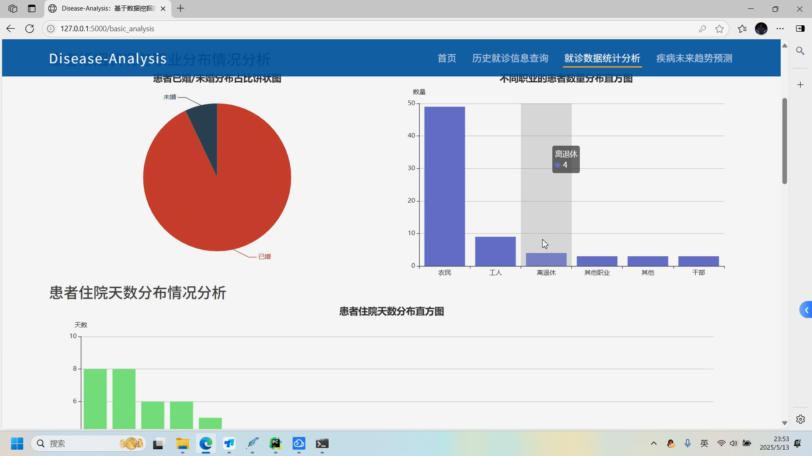
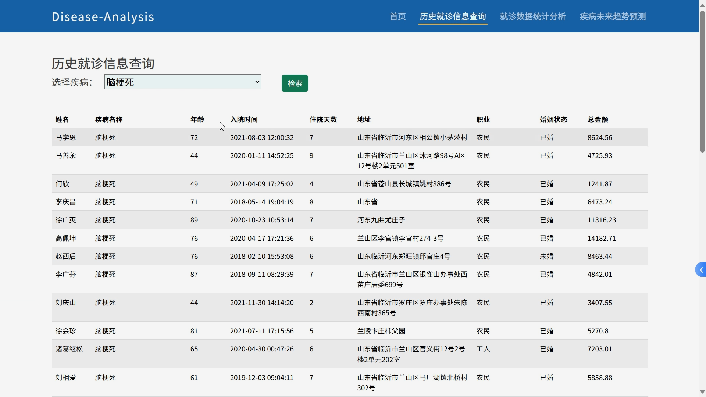
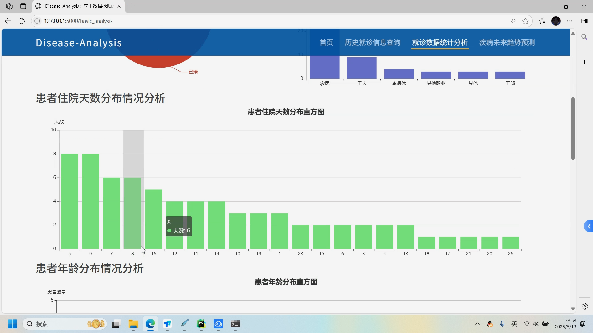
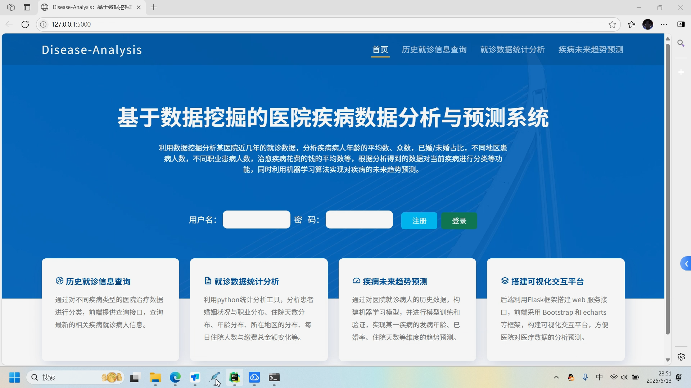
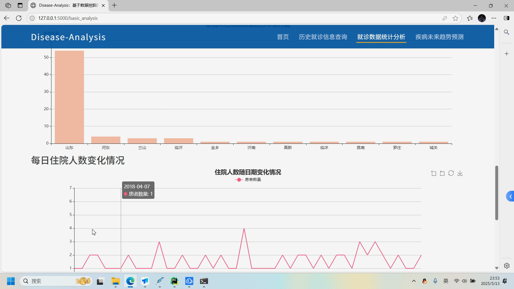
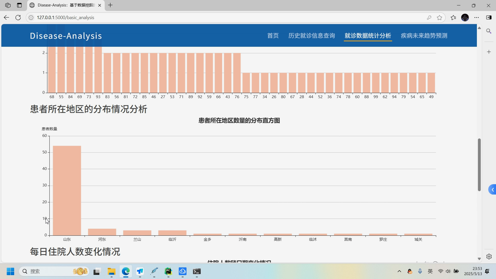
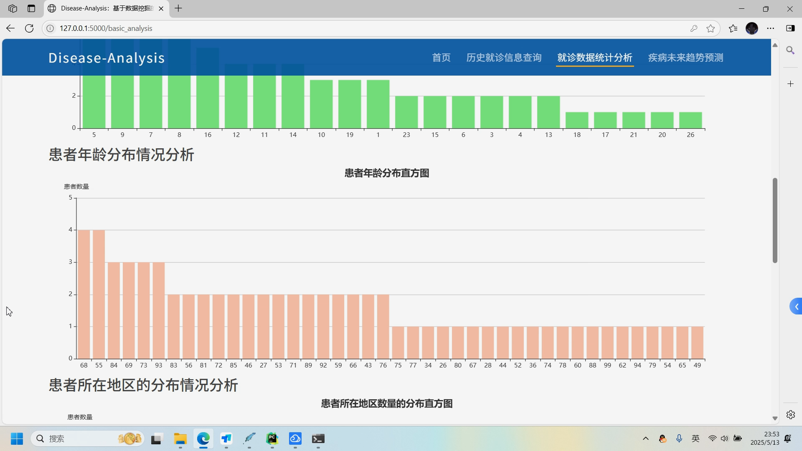
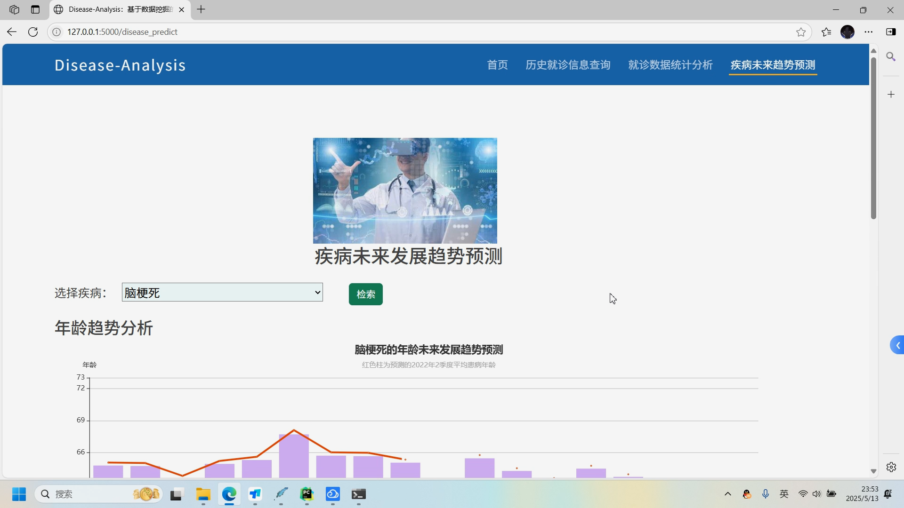
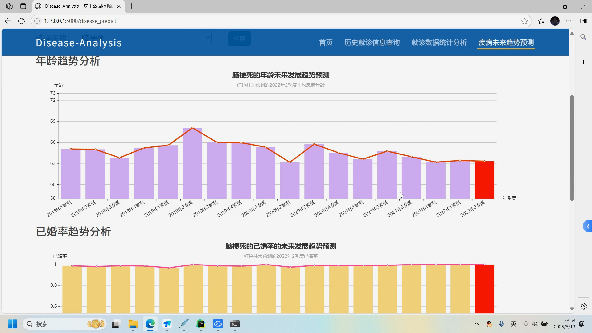
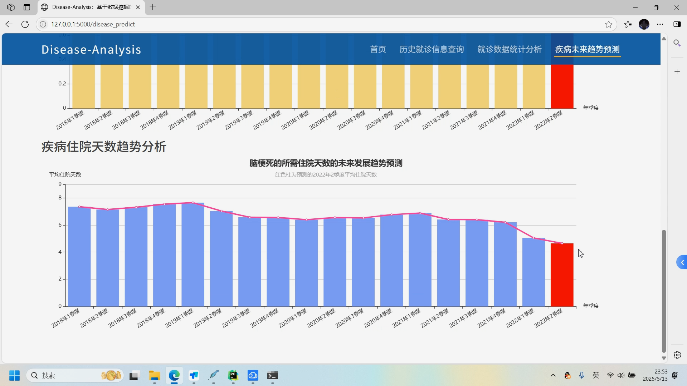
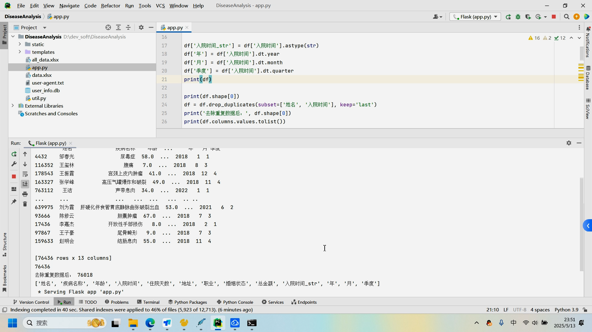
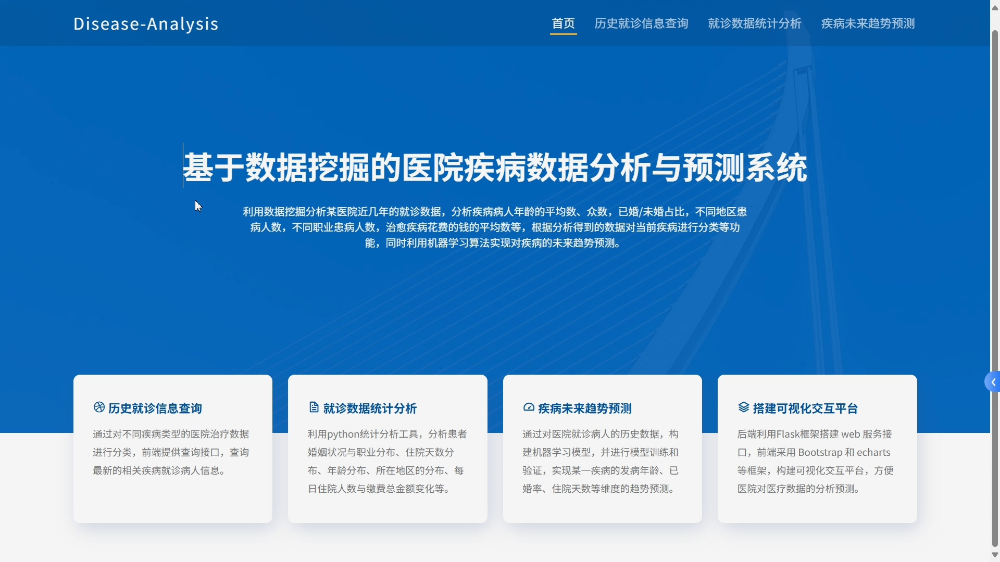

